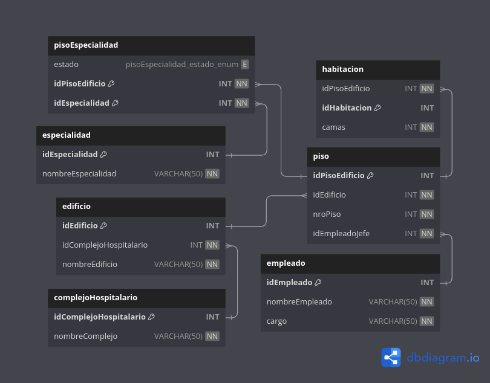

# Modulo Hospital

## Consultas

#### 1. Obtener el nombre del empleado que trabaja en el piso con id 3.

```SQL
SELECT e.nombreEmpleado FROM empleado e
JOIN piso p ON e.idEmpleado = p.idEmpleadoJefe
WHERE p.idPisoEdificio = 3;
```

#### 2. Mostrar el nombre y la especialidad de los pisos principales.

```SQL
SELECT e.nombreEspecialidad FROM especialidad e
JOIN pisoespecialidad p ON e.idEspecialidad = p.idEspecialidad
WHERE p.estado = "principal";
```

#### 3. Obtener el nombre del complejo hospitalario al que pertenece el edificio con id 5.

```SQL
SELECT c.nombreComplejo FROM complejohospitalario c
JOIN edificio e ON c.idComplejoHospitalario = e.idComplejoHospitalario
WHERE e.idEdificio = 5;
```

#### 4. Mostrar el nombre y la cantidad de camas de las habitaciones en el piso con id 8.

```SQL
SELECT p.nroPiso AS ubicacion_piso, SUM(h.camas) FROM piso p
JOIN habitacion h ON p.idPisoEdificio = h.idPisoEdificio
WHERE p.idPisoEdificio = 8;
```

#### 5. Obtener el nombre del empleado que trabaja en el edificio con id 6.

```SQL
SELECT e.nombreEmpleado FROM empleado e
JOIN piso p ON e.idEmpleado = p.idEmpleadoJefe
WHERE p.idEdificio = 6;
```

#### 6. Mostrar el nombre de las especialidades en el piso principal del edificio con id 3.

```SQL
SELECT ed.nombreEdificio, p.nroPiso AS ubicacion_piso, SUM(h.camas) AS camas FROM edificio ed
JOIN piso p ON ed.idEdificio = p.idEdificio
JOIN habitacion h ON p.idPisoEdificio = h.idPisoEdificio
JOIN pisoespecialidad pe ON p.idPisoEdificio = pe.idPisoEdificio
WHERE pe.estado = "principal" AND ed.idEdificio = 2;
```

#### 7. Obtener el nombre y el cargo de los empleados que trabajan en el edificio con id 7.

```SQL
SELECT e.nombreEmpleado, e.cargo FROM empleado e
JOIN piso p ON e.idEmpleado = p.idEmpleadoJefe
WHERE p.idEdificio = 7;
```

#### 8. Mostrar el nombre y la ubicación de los pisos con más de 15 camas.

```SQL
SELECT p.idPisoEdificio, p.nroPiso AS ubicacion_piso, SUM(h.camas) FROM habitacion h
JOIN piso p ON h.idPisoEdificio = p.idPisoEdificio
GROUP BY p.idPisoEdificio
HAVING SUM(h.camas) > 15;
```

#### 9. Obtener el nombre del complejo hospitalario que tiene el mayor número de edificios.

```SQL
SELECT c.nombreComplejo FROM complejohospitalario c
JOIN edificio e ON c.idComplejoHospitalario = e.idComplejoHospitalario
GROUP BY c.idComplejoHospitalario
ORDER BY COUNT(*) DESC
LIMIT 1;
```

#### 10. Mostrar el nombre y la especialidad de los empleados que trabajan en el piso principal del edificio con id 1.

```SQL
SELECT e.nombreEmpleado, e.cargo, es.nombreEspecialidad  FROM empleado e
JOIN piso p ON e.idEmpleado = p.idEmpleadoJefe
JOIN pisoespecialidad pe ON p.idPisoEdificio = pe.idPisoEdificio
JOIN especialidad es ON pe.idEspecialidad = es.idEspecialidad
WHERE p.idEdificio = 1;
```

#### 11. Obtener el nombre y la ubicación de los pisos donde trabaja un "Fisioterapeuta".

```SQL
SELECT ed.nombreEdificio, p.nroPiso AS ubicacion_piso FROM empleado e, piso p, edificio ed
WHERE e.idEmpleado = p.idEmpleadoJefe
AND p.idEdificio = ed.idEdificio
AND e.cargo = 'fisioterapeuta';
```

#### 12. Mostrar el nombre y el cargo de los empleados que trabajan en más de un piso. 

```SQL
SELECT e.nombreEmpleado, e.cargo FROM empleado e
WHERE (
	SELECT COUNT(*) FROM piso p
	WHERE p.idEmpleadoJefe = e.idEmpleado
) > 1;
```

#### 13. Obtener el nombre y la cantidad de camas de las habitaciones en el piso principal del edificio con id 2.

```SQL
SELECT ed.nombreEdificio, p.nroPiso AS ubicacion_piso, SUM(h.camas) AS camas FROM edificio ed
JOIN piso p ON ed.idEdificio = p.idEdificio
JOIN habitacion h ON p.idPisoEdificio = h.idPisoEdificio
JOIN pisoespecialidad pe ON p.idPisoEdificio = pe.idPisoEdificio
WHERE pe.estado = "principal" AND ed.idEdificio = 2;
```

#### 14. Mostrar el nombre del complejo hospitalario que tiene al menos un edificio sin asignación de empleados.

```SQL
SELECT DISTINCT ch.nombreComplejo FROM complejoHospitalario ch
JOIN edificio ed ON ch.idComplejoHospitalario = ed.idComplejoHospitalario
LEFT JOIN piso p ON ed.idEdificio = p.idEdificio
LEFT JOIN empleado e ON p.idEmpleadoJefe = e.idEmpleado
WHERE p.idEdificio IS NULL OR e.idEmpleado IS NULL;
```

## Procedimientos almacenados

#### 1. Crear un procedimiento almacenado que asigne un empleado a un piso dado su identificador.

```SQL
DELIMITER //
DROP PROCEDURE IF EXISTS asignarEmpleadoPiso //
CREATE PROCEDURE asignarEmpleadoPiso(
	in idPiso INT,
	in idEmpleado INT
)
BEGIN
	UPDATE piso SET idEmpleadoJefe = idEmpleado WHERE idPisoEdificio = idPiso;
    SELECT * FROM piso;
END //
DELIMITER ;
call asignarEmpleadoPiso(1, 1);
```

#### 2. Crear un procedimiento almacenado que cuente el número de habitaciones en un piso específico.

```SQL
DELIMITER //
DROP PROCEDURE IF EXISTS numHabitacionesPiso //
CREATE PROCEDURE numHabitacionesPiso(
	in idPiso INT
)
BEGIN
	SELECT COUNT(*) AS habitaciones FROM habitacion
	WHERE idPiso = habitacion.idPisoEdificio;
END //
DELIMITER ;
call numHabitacionesPiso(3);
```

#### 3. Crear un procedimiento almacenado que actualice la ubicación de un piso dado su identificador.

```SQL
DELIMITER //
DROP PROCEDURE IF EXISTS nuevaUbicacionPiso //
CREATE PROCEDURE nuevaUbicacionPiso(
	in idPiso INT,
    in ubicacion INT
)
BEGIN
	UPDATE piso SET nroPiso = ubicacion WHERE idPisoEdificio = idPiso;
    SELECT * FROM piso;
END //
DELIMITER ;
call nuevaUbicacionPiso(3, 1);
```

#### 4. Crear un procedimiento almacenado que elimine la asignación de un empleado de un piso dado su identificador.

```SQL
DELIMITER //
DROP PROCEDURE IF EXISTS eliminacionEmpleadoPiso //
CREATE PROCEDURE eliminacionEmpleadoPiso(
	in idPiso INT
)
BEGIN
	UPDATE piso SET idEmpleadoJefe = NULL WHERE idPisoEdificio = idPiso;
    SELECT * FROM piso;
END //
DELIMITER ;
call eliminacionEmpleadoPiso(3);
```

#### 5. Crear un procedimiento almacenado que devuelva los empleados que tienen una especialidad específica.

- **Por nombre:**

    ```SQL
    DELIMITER //
    DROP PROCEDURE IF EXISTS empleadosSegunEspecialidad //
    CREATE PROCEDURE empleadosSegunEspecialidad(
        in especialidad VARCHAR(50)
    )
    BEGIN
        SELECT e.* FROM empleado e
        JOIN piso p ON e.idEmpleado = p.idEmpleadoJefe
        JOIN pisoespecialidad pe ON p.idPisoEdificio = pe.idPisoEdificio
        JOIN especialidad es ON pe.idEspecialidad = es.idEspecialidad
        WHERE es.nombreEspecialidad = especialidad;
    END //
    DELIMITER ;
    call empleadosSegunEspecialidad("ortopedia");
    ```

- **Por id:**

    ```SQL
    DELIMITER //
    DROP PROCEDURE IF EXISTS empleadosSegunEspecialidad //
    CREATE PROCEDURE empleadosSegunEspecialidad(
        in idEspecialidad INT
    )
    BEGIN
        SELECT e.* FROM empleado e
        JOIN piso p ON e.idEmpleado = p.idEmpleadoJefe
        JOIN pisoespecialidad pe ON p.idPisoEdificio = pe.idPisoEdificio
        WHERE pe.idEspecialidad = idEspecialidad;
    END //
    DELIMITER ;
    call empleadosSegunEspecialidad(6);
    ```

#### 6. Crear un procedimiento almacenado que cuente el número de edificios en un complejo hospitalario específico.

- **Por nombre:**

    ```SQL
    DELIMITER //
    DROP PROCEDURE IF EXISTS numEdificiosComplejo //
    CREATE PROCEDURE numEdificiosComplejo(
        in complejo VARCHAR(50)
    )
    BEGIN
        SELECT COUNT(*) AS edificios FROM edificio e
        JOIN complejohospitalario ch ON e.idComplejoHospitalario = ch.idComplejoHospitalario
        WHERE ch.nombreComplejo = complejo;
    END //
    DELIMITER ;
    call numEdificiosComplejo("Ultrices Posuere Consulting");
    ```

- **Por id:**

    ```SQL
    DELIMITER //
    DROP PROCEDURE IF EXISTS numEdificiosComplejo //
    CREATE PROCEDURE numEdificiosComplejo(
        in idComplejo INT
    )
    BEGIN
        SELECT COUNT(*) AS edificios FROM edificio
        WHERE edificio.idComplejoHospitalario = idComplejo;
    END //
    DELIMITER ;
    call numEdificiosComplejo(6);
    ```

#### 7. Crear un procedimiento almacenado que devuelva los pisos asignados a empleados de un cargo específico.

```SQL
DELIMITER //
DROP PROCEDURE IF EXISTS pisosCargoEmpleado //
CREATE PROCEDURE pisosCargoEmpleado(
	in cargo VARCHAR(50)
)
BEGIN
	SELECT p.* FROM piso p
	JOIN empleado e ON p.idEmpleadoJefe = e.idEmpleado
	WHERE e.cargo = cargo;
END //
DELIMITER ;
call pisosCargoEmpleado("enfermera");
```

#### 8. Crear un procedimiento almacenado que asigne una especialidad a un piso específico.

```SQL
DELIMITER //
DROP PROCEDURE IF EXISTS asignarEspecialidadPiso //
CREATE PROCEDURE asignarEspecialidadPiso(
	in estado VARCHAR(10),
	in idPiso INT,
	in idEspecialidad INT
)
BEGIN
	UPDATE pisoespecialidad pe SET pe.idEspecialidad = idEspecialidad
    WHERE pe.estado = estado AND pe.idPisoEdificio = idPiso;
    SELECT * FROM pisoespecialidad;
END //
DELIMITER ;
call asignarEspecialidadPiso("principal", 1, 1);
```

#### 9. Crear un procedimiento almacenado que devuelva los empleados que no están asignados a ningún piso.

```SQL
DELIMITER //
DROP PROCEDURE IF EXISTS empleadosSinPiso //
CREATE PROCEDURE empleadosSinPiso()
BEGIN
	SELECT e.* FROM empleado e
	LEFT JOIN piso p ON e.idEmpleado = p.idEmpleadoJefe
    WHERE p.idEmpleadoJefe IS NULL;
END //
DELIMITER ;
call empleadosSinPiso();
```

## Modelo fisico



## Uso del Proyecto

Clona este repositorio en tu maquina local:

```BASH
git clone https://github.com/jstorra/hospital-SQL.git
```

---

<p align="center">Developed by <a href="https://github.com/jstorra">@jstorra</a></p>